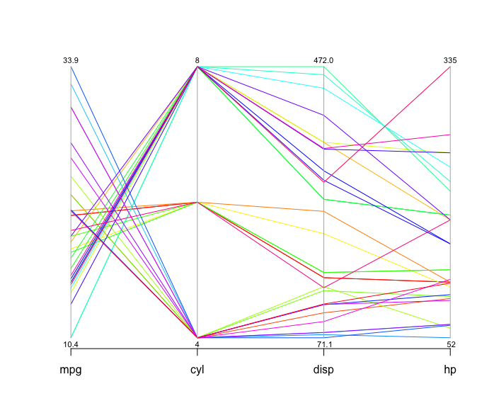
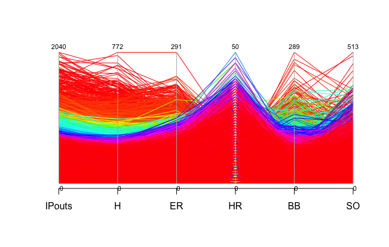
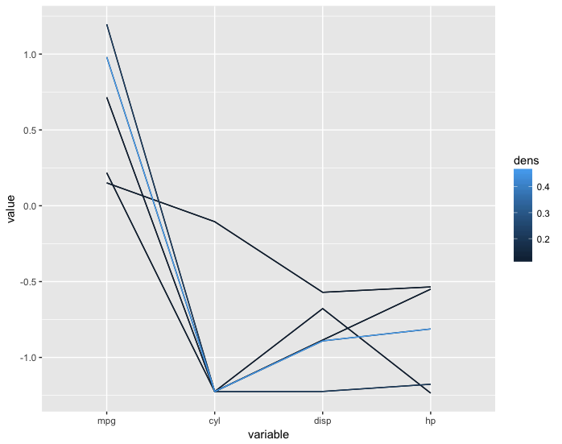
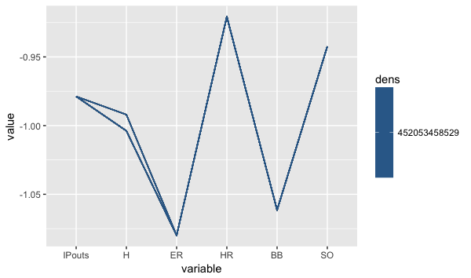

# parcoordtutorial
##Tutorial on the parallel coordinates visualization method.

Table of Contents
=================

  * [Introduction to parallel coordinates.](#introduction)

    * [What is parallel coordinate?](#what)
    * [How can parallel coordinate be helpful?](#what)
  
##Introduction
###What is parallel coordinate? 
Parallel coordinates was invented by Alfred Inselberg in the 1970s as a way to visualize high-dimensional data. A parallel coordinate plot maps each row in the data table as a line, or profile. Each attribute of a row is represented by a point on the line. 

The values in a parallel coordinate plot are always normalized into percentages. This means that for each point along the X-axis (attributes), the minimum value in the corresponding column is set to 0% and the maximum value in that column is set to 100% along the Y-axis. 

If you would like more info, here is link that explains in greater detail.
[What is a Parallel Coordinate Plot?](https://docs.tibco.com/pub/sfire-analyst/7.5.0/doc/html/WebHelp/para/para_what_is_a_parallel_coordinate_plot.htm)
###How can parallel coordinate helpful?
Parallel coordinates can help define patterns and coorlilation that can explained by different variables. 

###Example:
```R
library(MASS)
data("mtcars")
parcoord( mtcars[,1:4], col=rainbow(length(mtcars[,1])), var.label=TRUE)
```
Here is a parallel coordinates plot for cars based on their MPG, cylinder, displacement and horsepower 


You can tell a lot about the data from looking at this visualization. The cylinders axis stands out because it only has a few different values. The number of cylinders can only be a whole number, and there aren’t more than eight here, so all the lines have to pass through a small number of points. Data like this, and also categorical data, are usually not well suited for parallel coordinates. As long as there is only one or two, it’s not a problem, but when the data is largely or completely categorical, parallel coordinates do not show any useful information anymore.

In the space between MPG and cylinders, you can tell that eight-cylinder cars generally have lower mileage than six- and four-cylinder ones. Just follow the lines and look at how they cross: lots of crossing lines are an indication of an inverse relationship, and that is clearly the case here: the more cylinders, the lower the mileage.

The mtcars data set only has 32 rows, you can imagine that the plot can get very messy if we have a larger dataset. Let's take a look at a much larger data set. 
Here is Sean Lahman's baseball dataset which has 44,963 rows. 
[Baseball Data](http://www.seanlahman.com/baseball-archive/statistics/)

You will need to download the data and import it through R. For simplicity, we will be looking at columns 13 to 18, which has the number of inning pitched, hits allowed, earned runs, home runs allowed, balls and strikeouts.


###Example:
```R
library(MASS) 
parcoord( Pitching[,13:18], col=rainbow(length(Pitching[,1])), var.label=TRUE)
```


As you can see the trend in this plot is very much indistinguishible. One common techinque to make the plot clearer called **brushing**, which essentially highlights the part of the data we would like to look bringing it to the foreground while the other lines remained in the background. The result is a brushed part of the lines in heavy black, with the rest still in the background in gray for context. 

###How to make this plot clearer?
The problem with the parallel coordinates above is that the screen is too cluttered with many lines, making hard to identify the trend. In order to avoid this problem, we can use the fredparcoord package which plots only the lines having the highest estimated multivariate density.
###Example:
```R
library(freqparcoord)
data("mtcars")
freqparcoord(mtcars,m=5,dispcols=1:4,k=7)
```
**x:** the data
**m:** the m most frequest rows of x which will plotted from each group
**dispcols:** the number of displayed columns
**k:** the grouping of k nearest neighbors to use for density estimation


The trend is in plot is very distinguishable, high mpg models have less cylinders indicated by the downward sloping lines from mpg to cyl. It is interesting to see here that the number of cylinders have does not have much of an effect on horsepower, something we could not clearly see from the previous parallel coordinates.  

Now lets take a long at our larger baseball pitching dataset. 
###Example:
```R
library(freqparcoord)
freqparcoord(Pitching[,13:18],m=10,k=posjitter(70)) 
```

