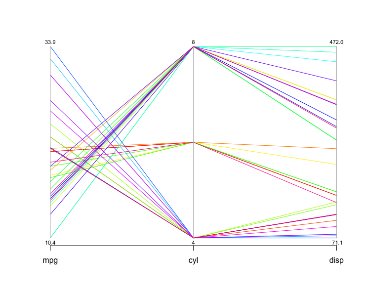
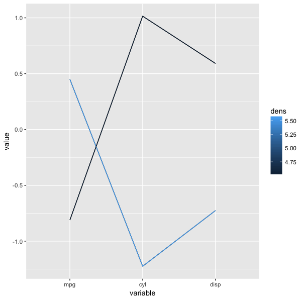

# parcoordtutorial

<h3>Tutorial on the parallel coordinates visualization method.</h3>

Table of Contents
=================
* [Introduction](#introduction)
    * [What is parallel coordinate?](#what-is-parallel-coordinate)
    * [How can parallel coordinate be helpful?](#how-can-parallel-coordinate-helpful)
    * [How to make this plot clearer?](#how-to-make-this-plot-clearer)
 * [What parallel coordinates methods can do?](#what-parallel-coordinates-methods-can-do)
   * [How to identify outliers?](#how-to-identify-outliers)
   * [Testing for independence of variables](#testing-for-independence-of-variables)
   * [Cluster Finding](#cluster-finding)
* [Resources](#resources)
  * [Websites](#websites)
  * [Books](#books)
  * [Papers](#papers)
* [Packages for Parallel Coordinates](#software)
  
<h2>Introduction</h2>
<h3>What is parallel coordinate? </h3>
Parallel coordinates method was invented by Alfred Inselberg in the 1970s as a way to visualize high-dimensional data. A parallel coordinate plot maps each row in the data table as a line or profile. Each attribute of a row is represented by a point on the line. As opposed to a normal line graph, a single line in a parallel coordinates graph connects a series of values, each associated with a variable. Note that each variable may have different units hence the need for these values to be normalized. 
The values in a parallel coordinate plot are always normalized into percentages. This means that for each point along the X-axis (attributes), the minimum value in the corresponding column is set to 0% and the maximum value in that column is set to 100% along the Y-axis. 

If you would like more info, here is link that explains in greater detail.
[What is a Parallel Coordinate Plot?](https://docs.tibco.com/pub/sfire-analyst/7.5.0/doc/html/WebHelp/para/para_what_is_a_parallel_coordinate_plot.htm)

<h3>How can parallel coordinate helpful?</h3>
The strength of parallel coordinates is their ability to bring meaningful multivariate patterns and comparisons to light when used interactively for analysis.
Parallel coordinates can reveal correlations between multiple variables. This is particularly useful when you want to identify which conditions correlate highly with a particular outcome. For instance, which what is the demographic of those who voted for a Donald Trump.

<h3>Example:</h3>
<h4> Parcoord Package <h4>

<h4> Freqparcoord Package </h4>

The 494 counties where Donald Trump won the primaries have high percentages of white voters and low percentages of minority voters.

<b>Demographic profile in percentages</b>

|  White | African American  |American Indian    |     Asian | Pacific Islander  | Mixed Race |   Hispanic |
|---|---|:-:|---|---|---|---|
| 85.16 |   9.54 |   1.75  |   1.41 | 0.12   |2.02   | 7.83 |


[Code to generate the above plots](inst/trump.R) <br>
[Data courtesy of Kaggle](https://www.kaggle.com/benhamner/2016-us-election)

<h3>Example:</h3>

```R
library(MASS)
data("mtcars")
parcoord( mtcars[,1:4], col=rainbow(length(mtcars[,1])), var.label=TRUE)
```
Here is a parallel coordinates plot for cars based on their <b>MPG, cylinder, displacement and horsepower </b>


You can tell a lot about the data from looking at this visualization. The cylinders axis stands out because it only has a few different values. The number of cylinders can only be a whole number, and there aren’t more than eight here, so all the lines have to pass through a small number of points. Data like this, and also categorical data, are usually not well suited for parallel coordinates. As long as there is only one or two, it’s not a problem, but when the data is largely or completely categorical, parallel coordinates do not show any useful information anymore.

In the space between MPG and cylinders, you can tell that eight-cylinder cars generally have lower mileage than six- and four-cylinder ones. Just follow the lines and look at how they cross: lots of crossing lines are an indication of an inverse relationship, and that is clearly the case here: the more cylinders, the lower the mileage.

The mtcars data set only has 32 rows, you can imagine that the plot can get very messy if we have a larger dataset. Let's take a look at a much larger data set. 
Here is Sean Lahman's baseball dataset which has 44,963 rows. 
[Baseball Data](http://www.seanlahman.com/baseball-archive/statistics/)

For the complete dataset, please download the data through the link above and import it to R. The pitching data frame is included in data directory. For simplicity, we will be looking at columns 13 to 18, which has the number of inning pitched, hits allowed, earned runs, home runs allowed, balls and strikeouts.
Here is how to process the data. 
```R
library(MASS) 
read.csv('~/parcoordtutorial/data/Pitching.csv') # path to the repo
parcoord( Pitching[,13:18], col=rainbow(length(Pitching[,1])), var.label=TRUE)
```
To explore other dataset simply download the csv file and use the <b>read.csv() </b> function with the path to the downloaded data as the parameter. Here is a massive list of public datasets. 

[Awesome Public Datasets](https://github.com/caesar0301/awesome-public-datasets)


As you can see the trend in this plot is very much indistinguishible. One common techinque to make the plot clearer called <b>brushing</b>, which essentially highlights the part of the data we would like to look bringing it to the foreground while the other lines remained in the background. The result is a brushed part of the lines in heavy black, with the rest still in the background in gray for context. 

<h3>How to make this plot clearer?</h3>
The problem with the parallel coordinates above is that the screen is too cluttered with many lines, making hard to identify the trend. In order to avoid this problem, we can use the freqparcoord package which plots only the lines having the highest estimated multivariate density.
<h3>Example:</h3>

```R
library(freqparcoord)
data("mtcars")
freqparcoord(mtcars,m=5,dispcols=1:4,k=7)
```
**x:** the data

**m:** the m most frequest rows of x which will plotted from each group

**dispcols:** the number of displayed columns

**k:** the grouping of k nearest neighbors to use for density estimation


The trend is in plot is very distinguishable, high mpg models have less cylinders indicated by the downward sloping lines from mpg to cyl. It is interesting to see here that the number of cylinders have does not have much of an effect on horsepower, something we could not clearly see from the previous parallel coordinates.  

Now lets take a long at our larger baseball pitching dataset. 
<h3>Example:</h3>

```R
library(freqparcoord)
freqparcoord(Pitching[,13:18],m=10,k=posjitter(70)) 
```


Here you can see that there is clear coorelation between the number of hits allowed and the earned run allowed by a pitcher. The downward sloping line from H to ER indicates that the lower the number of hits allowed by a pitcher, the lower his ER number will be. Likewise, BB and SO also have a similar relation, the lower the BB the higher the strikeouts. 


<h2>What parallel coordinates methods can do?</h2>

<h3>How to identify outliers?</h3>
With such large data set, outliers are likely normalized and insignficant. But lets take a look at how we can identify them, and see the what kind of characteristic these outliers shared. 

Lets take another look at our mtcars data.
<h3>Example:</h3>

```r
library(freqparcoord)
p <- freqparcoord(mtcars[,1:4],-1,k=7,keepidxs=4)
> p$idxs
[1] 31
> mtcars[31,]
              mpg cyl disp  hp drat   wt qsec vs am gear carb
Maserati Bora  15   8  301 335 3.54 3.57 14.6  0  1    5    8
```

We found our outlier, a <b>Maserati Bora with 335 horsepower!</b> Try to apply the same code to the pitching data. The result should be interesting. 
<h3>Testing for independence of variables</h3>
When fitting a model with many potential explantory variables using the stepwise regression procedure, there are potentially numerous number of models that need to be fitted. For example, lets take a look at our mtcars data. There are 11 columns or varialbes in the data frame. 
mtcars
A data frame with 32 observations on 11 variables.
Brief explanation of the variable names are provided below:

*   <b>mpg</b>: Miles/(US) gallon
*   <b>cyl</b>: Number of cylinders
*   <b>disp</b>: Displacement (cu.in.)
*   <b>hp</b>: Gross horsepower
*   <b>drat</b>: Rear axle ratio
*   <b>wt</b>: Weight (lb/1000)
*   <b>qsec</b>: 1/4 mile time
*   <b>vs</b>: V/S
*   <b>am</b> :Transmission (0 = automatic, 1 = manual)
*   <b>gear</b>: Number of forward gears
*   <b>carb</b>: Number of carburetors


We are looking see the relationship between mpg and the other variables. We can do this by fitting a linear model with mpg as the response variable and the rest as our explanatory variables. Some of the variables which are supposed to be factors are entered as numeric. As this will interfere with the analysis we want to do, the variables have to be assigned to their appropriate type or class by running the following code. 
<h5>Try to run this code</h5>

```R
mtcars$cyl <- as.factor(mtcars$cyl)
mtcars$vs <- as.factor(mtcars$vs)
mtcars$am <- factor(mtcars$am)
mtcars$gear <- factor(mtcars$gear)
mtcars$carb <- factor(mtcars$carb)
lmodel <- lm(mtcars$mpg ~ ., data=mtcars)
```

Our model is very large and this is not a good thing. We only want to include variables whose have an association with our reponse variable. The rear axle ratio probably has a very minor if any impact on mpg compared to number of cylinders. 

To select the most informative variables, which were included in a multiple (linear) regression model, we can do that by using the <b>stepAIC</b> function. This will go through 8 different steps using the AIC as our selection criteria for the model. 

```R
library(MASS)
lmodel <- lm(mtcars$mpg ~ ., data=mtcars)
rlmodel<- stepAIC(lmodel)
```

Parallel coordinates can give us a rough overview of which variable we should or should not include in our model, the inpendence between variables. Here we can see that lines between the variables do not follow any pattern.

<h5>Run this code to obtain the plot.</h5>

```R
data("mtcars") 
freqparcoord(mtcars ,m=10,k=5)
```
<h5>Try changing m and k<br>
How does a higher k value impact our plot?<br>
What about the case for m?</h5>


*By looking at this parallel coordinates plot, which variable we should include in our linear model?*


If we follow the two highest mpg line in our plot, we can see that they have 4 cylinder cars, low horsepower, light weight and manual tranmission. Our linear model supports just that. 

```R
> summary(rlmodel)
Call:
lm(formula = mtcars$mpg ~ cyl + hp + wt + am, data = mtcars)

Residuals:
    Min      1Q  Median      3Q     Max 
-3.9387 -1.2560 -0.4013  1.1253  5.0513 

Coefficients:
            Estimate Std. Error t value Pr(>|t|)    
(Intercept) 33.70832    2.60489  12.940 7.73e-13 ***
cyl6        -3.03134    1.40728  -2.154  0.04068 *  
cyl8        -2.16368    2.28425  -0.947  0.35225    
hp          -0.03211    0.01369  -2.345  0.02693 *  
wt          -2.49683    0.88559  -2.819  0.00908 ** 
am1          1.80921    1.39630   1.296  0.20646    
---
Signif. codes:  0 ‘***’ 0.001 ‘**’ 0.01 ‘*’ 0.05 ‘.’ 0.1 ‘ ’ 1

Residual standard error: 2.41 on 26 degrees of freedom
Multiple R-squared:  0.8659,    Adjusted R-squared:  0.8401 
F-statistic: 33.57 on 5 and 26 DF,  p-value: 1.506e-10

```


Now compare the above plot with a plot of 10 randomly distributed variables below. Do you see the difference?


<h3>Cluster Finding</h3>
Cluster analysis is statistical techniques that are used simply to gain further insight into a group of observations. We use cluster analysis to find out if the observations naturally group together based on some characteristic. Different clusterring algoritm can be applied to a set of data to define such groups. 
One way to do this is through parallel coordinates. Lets take another look at our running example, mtcars. This time we are going to look at the first three columns of the dataset: mpg, cylinder, and displacement. 

```R
parcoord( mtcars[,1:3], col=rainbow(length(mtcars[,1])), var.label=TRUE)
```


Do you see the clusters in this plot?
Now lets use the same data and apply freqparcoord k-th nearest neighbor density estimation. <br>
With the following parameters: <br>
<b> m (the number of lines of the plot) = 8 </b><br>
<b> k (Number of nearest neighbors to use for density estimation) = 4 </b>

```R
freqparcoord( mtcars[,1:3],m=8,k=4)
```


For more on cluster analysis, you would find the following links helpful. 

[Penn State Cluster Analysis](https://onlinecourses.science.psu.edu/stat505/node/138)

[Introduction to Cluster Analysis](https://www.stat.berkeley.edu/~s133/Cluster1.html)


<h2>Resources</h2>
<h4>Websites</h4>

*   [Graph theory applied to data visualization](https://www.youtube.com/playlist?list=PL35C0D424A858AE69)
<h4>Books</h4>

*   [The Art of R](https://www.amazon.com/Art-Programming-Statistical-Software-Design/dp/1593273843/ref=sr_1_1?s=books&ie=UTF8&qid=1489823972&sr=1-1&keywords=the+art+of+R)
*   [Parallel Coordinates: Visual Multidimensional Geometry and Its Applications](https://www.amazon.com/Parallel-Coordinates-Multidimensional-Geometry-Applications/dp/0387215077/)
<h4>Papers</h4>

*   [Parallel Coordinates for Explainatory Modelling analysis](http://ai2-s2-pdfs.s3.amazonaws.com/c2bb/03ce4e4d3254518edf13f816f6a8dc01a1ea.pdf)
*   [Multivariate Analysis Using Parallel Coordinates](https://www.perceptualedge.com/articles/b-eye/parallel_coordinates.pdf)
*   [Enhancing Parallel Coordinates: Statistical Visualizations for Analyzing Soccer Data](https://bib.dbvis.de/uploadedFiles/parallelCoordinatesSoccer.pdf)
*   [The Parallel Coordinates Matrix](http://www.cc.gatech.edu/~stasko/papers/eurovis12-pcm.pdf)

<h2>Packages for Parallel Coordinates</h2>

* [parcoord](https://stat.ethz.ch/R-manual/R-devel/library/MASS/html/parcoord.html)
* [freqparcoord](https://cran.r-project.org/web/packages/freqparcoord/freqparcoord.pdf)
* [parallel-coordinates](https://github.com/syntagmatic/parallel-coordinates)

